# Web Infrastructure Hardening: ModSecurity WAF & SSL/TLS Integration

## 📖 Project Overview
This project demonstrates the transition from a vulnerable web environment to a hardened, enterprise-ready infrastructure. I built a **LAMP stack** to host the **Damn Vulnerable Web Application (DVWA)** and implemented a **ModSecurity Web Application Firewall (WAF)**. The goal was to demonstrate how "Virtual Patching" can protect insecure code from OWASP Top 10 threats while ensuring data confidentiality through **SSL/TLS encryption**.

## 🧠 Skills Demonstrated
- Web application security hardening
- ModSecurity WAF deployment and tuning
- OWASP CRS rule interpretation
- Manual penetration testing (SQLi, XSS, Command Injection)
- Log analysis and forensic validation
- Apache security configuration
- TLS certificate generation and HTTPS enforcement

## 🛠️ Phase 1: Infrastructure Build & Baseline Setup
I began by building the target environment from the ground up on an Ubuntu server.

### **Key Actions:**
* **LAMP Stack Deployment:** Installed **Apache2**, **MariaDB (MySQL)**, and **PHP**.
* **DVWA Integration:** Configured the MySQL database and PHP permissions to allow DVWA to run in its native vulnerable state.
* **WAF Installation:** Installed `libapache2-mod-security2` and cloned the **OWASP Core Rule Set (CRS)** to provide baseline defense signatures.
* **Initial Posture:** I set the WAF to `DetectionOnly` mode to establish a baseline for vulnerability testing.

**DVWA RUNNING**
> 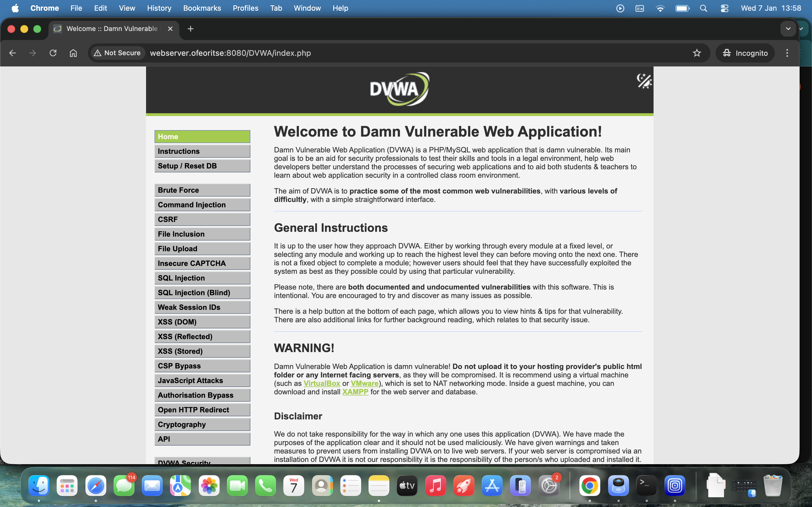
>
**Terminal showing the /usr/share/modsecurity-crs/rules directory**
> 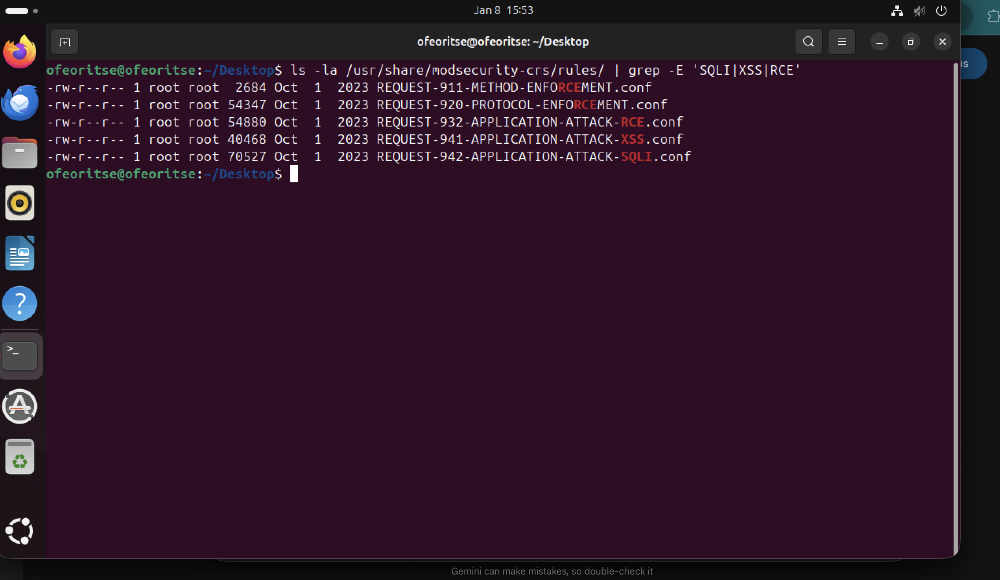

---
## 🧪 Phase 2: Vulnerability Validation (The "Before" State)
With the server live but unprotected, I conducted manual penetration tests over **HTTP** to prove the application was vulnerable to common exploits.

*Firewall detection only mode*
> 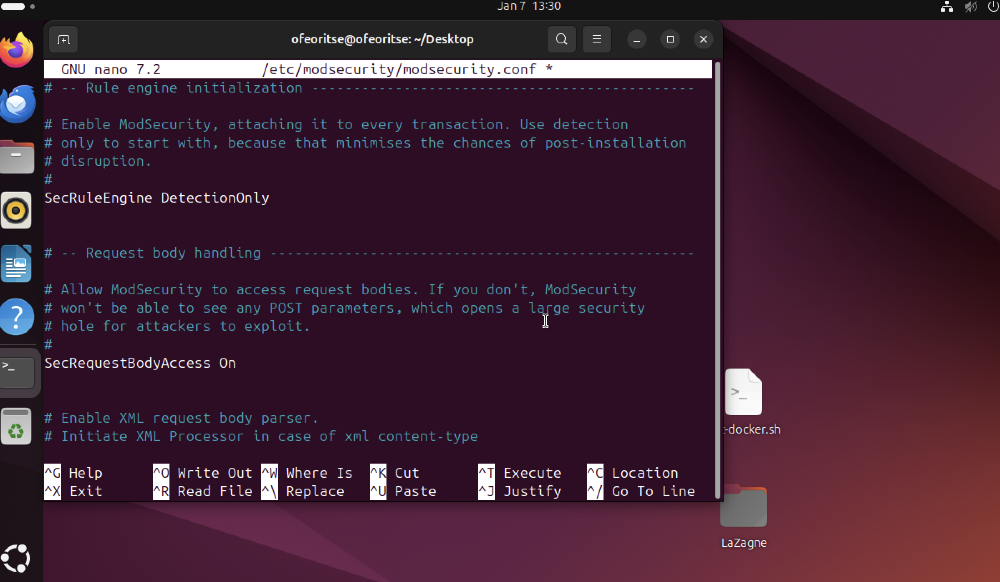

### **Attack Scenarios:**
* **SQL Injection (SQLi):** Successfully bypassed login logic using `1' OR 1=1 #`.
* **Injected , triggering a browser-side pop-up and demonstrating unauthorized JavaScript execution.
* **Command Injection:** Executed `127.0.0.1; whoami` to prove OS-level command access.

**Observation:** All attacks were successful. The WAF logged these events but did not intervene, simulating an exposed production environment.

**Successful SQL injection**
> 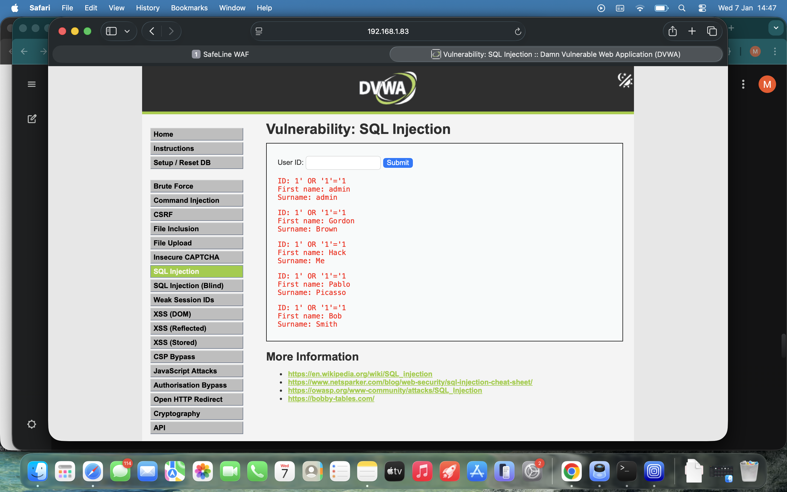
> 
**Successful cross site scripting**
> 
> 
**Successful command injection**
> 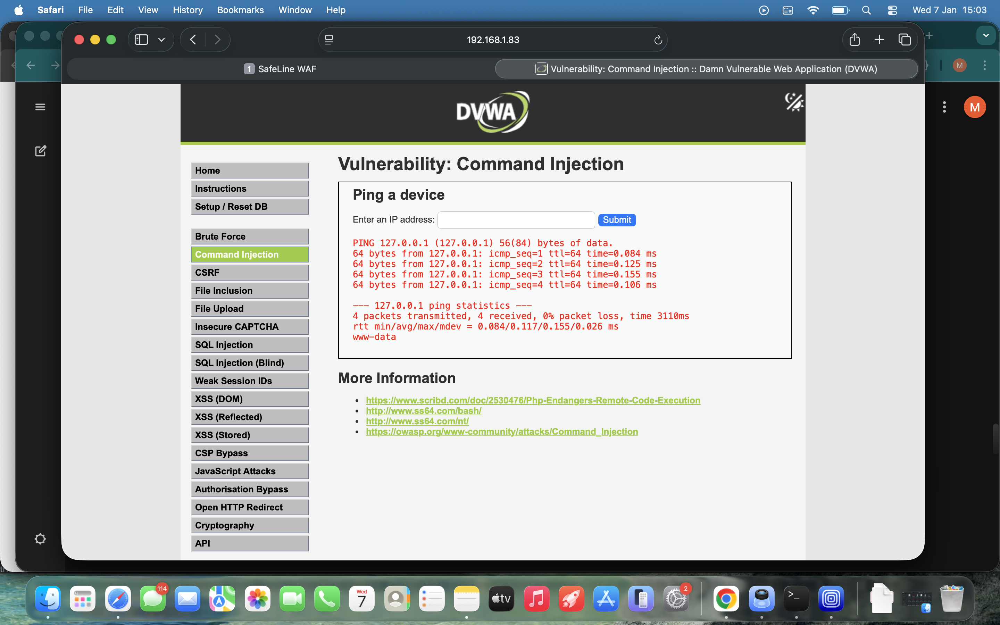

## 🛡️ Phase 3: Activating the Shield & Custom Error Handling
I transitioned the server to an **Active Prevention** posture and customized the user experience to maintain professional security standards.

* **Enabling the Engine:** Switched the `SecRuleEngine` from `DetectionOnly` to `On`.
* 
  **Firewall Security on**
  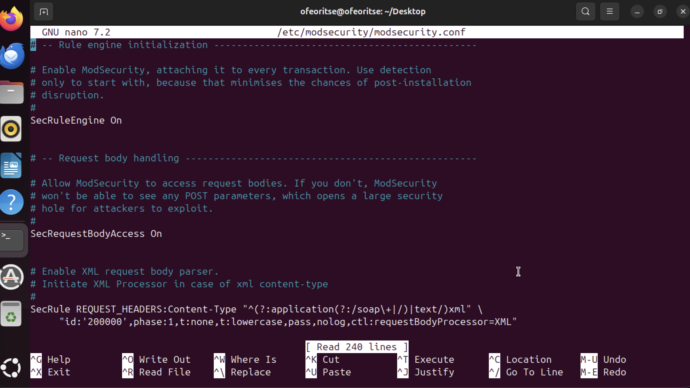
  
* **Signature Integration: Enabled the OWASP CRS to provide real-time pattern matching against known exploit strings.**.
* **Implementing the Custom 403 Page:**
    * I created a custom `error403.html` file in the web root. but later converted it to `error403.php`
      
      **Error403.html later chnage to error403.php**
       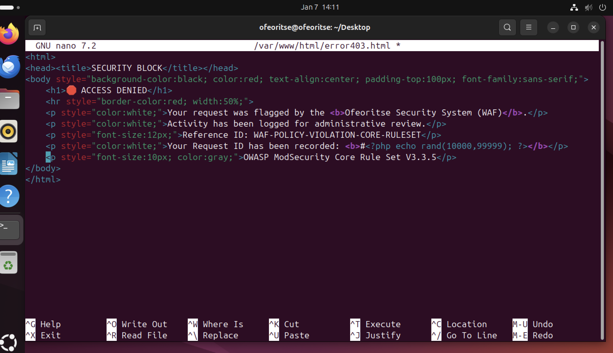
      
    * I configured Apache (`/etc/apache2/conf-enabled/security.conf`) with the directive: `ErrorDocument 403 /error403.php`.

      **Apache Security Configuration-error403**
       
    * **Reasoning:** Default Apache error pages can leak server versions or OS details. A custom page hides these details and provides a clean, professional "Access Denied" message.

**The Result:** I re-ran the same attack payloads. Every attempt was blocked, and instead of a generic server error, I was served my custom security page.

**Screenshot of SQLI, XSS and Command injection being blocked by Modsecurity WAF**

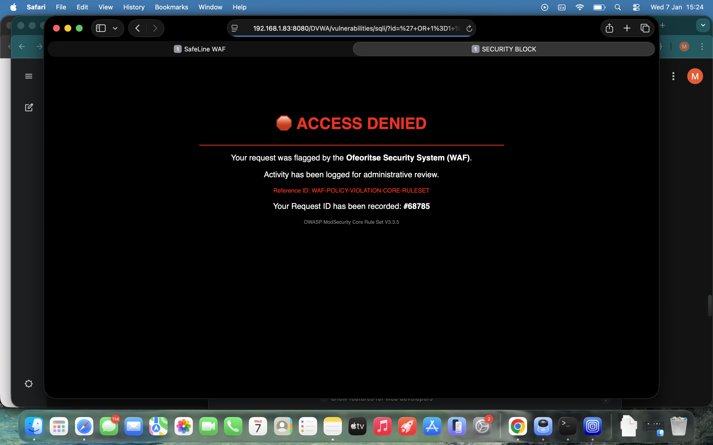

## 🕵️ Phase 4: Forensic Analysis (The Proof)
I analyzed the `/var/log/apache2/error.log` to verify the WAF's decision-making process.

### **Log Analysis & Forensic Verification**
To verify the WAF was functioning, I monitored the Apache error logs using `tail -n 20 /var/log/apache2/error.log | grep [RuleID]`. This allowed me to pinpoint the exact moment the WAF intercepted the malicious traffic.

**Key Findings:**
1.  **Rule ID 932100 (Command Injection):** Detected OS command shell patterns in the input.
2.  **Rule ID 941110 (XSS):** Identified script tag injection.
3.  **Rule ID 942100 (SQLi):** Caught via the libinjection library.

**Screenshot of apache error.log for SQLI, XSS and Command Injection**

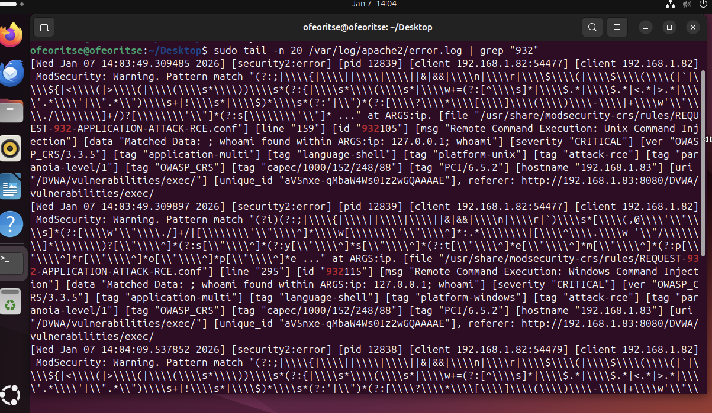

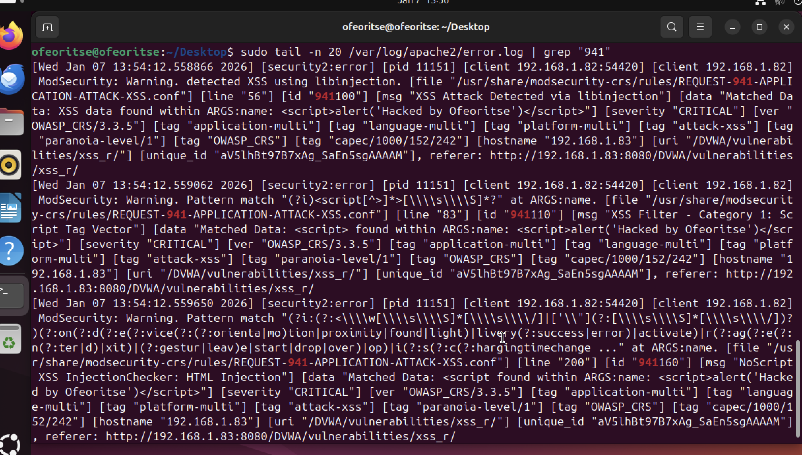

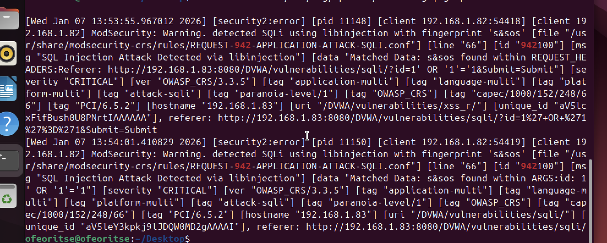

## 🔐 Phase 5: Final Hardening (SSL/TLS Encryption)
After the WAF was validated, I secured the "Transport Layer" to prevent credential sniffing and Man-in-the-Middle (MitM) attacks.

* **Implementation:** Used **OpenSSL** to generate a 2048-bit RSA private key and a self-signed certificate.
* **Enforcement:** Enabled the Apache `ssl` module and configured **Port 443**.
* **Verification:** Accessed the site via `https://`. After manually trusting the certificate in Safari, I confirmed the encrypted tunnel was active.

**Screenshot from chrome browser showing the self signed certificate**

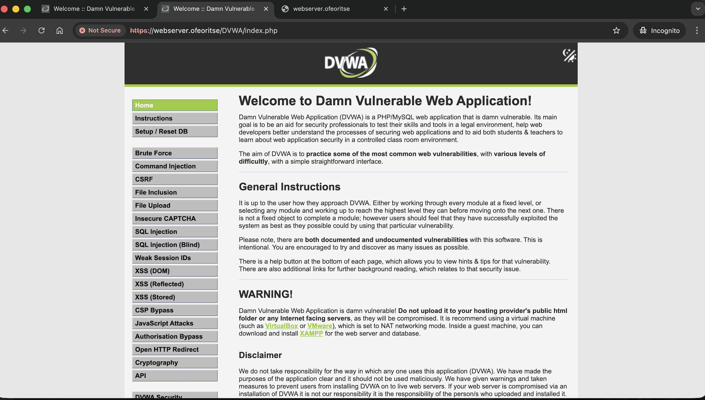

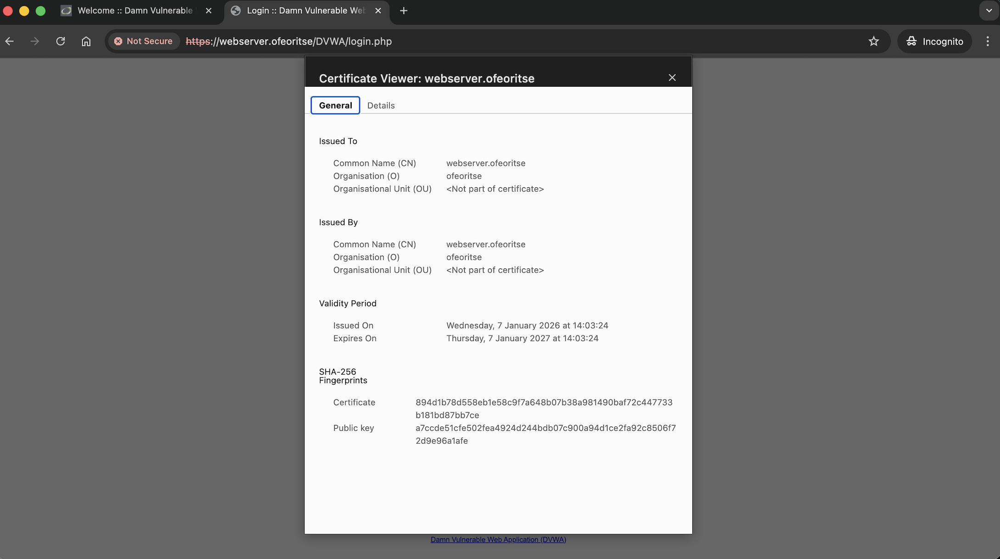

## 🎯 MITRE ATT&CK Mapping

| Attack Vector | MITRE Technique | Mitigation |
| :--- | :--- | :--- |
| **SQL Injection** | T1190 - Exploit Public-Facing Application | ModSecurity SQLi Signatures / libinjection |
| **XSS** | T1189 - Drive-by Compromise | OWASP CRS XSS Filter Patterns |
| **Command Injection** | T1059 - Command & Scripting Interpreter | OS Command Execution Rule Set |

---

## 🏁 Conclusion
This lab demonstrates a complete **Defense-in-Depth** strategy. By starting with a vulnerable baseline and incrementally adding layered defenses (**Infrastructure -> WAF -> Custom Error Handling -> SSL/TLS**), I successfully created a hardened environment that neutralizes threats at the network edge.

---

### 🧠 Technical Challenges & Troubleshooting
* **Path Discrepancies:** Encountered a "Directory Not Found" error when attempting to locate ModSecurity rules. I utilized the `find` and `grep` utilities to identify the system-specific path at `/usr/share/modsecurity-crs/`, ensuring the WAF was correctly referencing the signature database.
* **PHP Integration:** Resolved a "Blank Page" issue during DVWA setup by analyzing `/var/log/apache2/error.log`, which led to identifying and installing missing PHP dependencies (`php-gd`). i resolved the php dependency error by running these (`sudo apt update`, `sudo apt install php-mysql php-gd php-curl`, `sudo systemctl restart apache2`)

## 🗺️ Final Project Architecture (The Logic Flow)

1.  **Attacker (Macbook)** -> Sends Exploit via **HTTP (8080)**.
2.  **ModSecurity (Ubuntu)** -> Inspects, Scores, and **Blocks** the request.
3.  **Custom Redirect** -> Server serves **error403.php** (Masking server details).
4.  **Admin Access** -> Connection occurs via **HTTPS (443)** (Encrypted channel).

   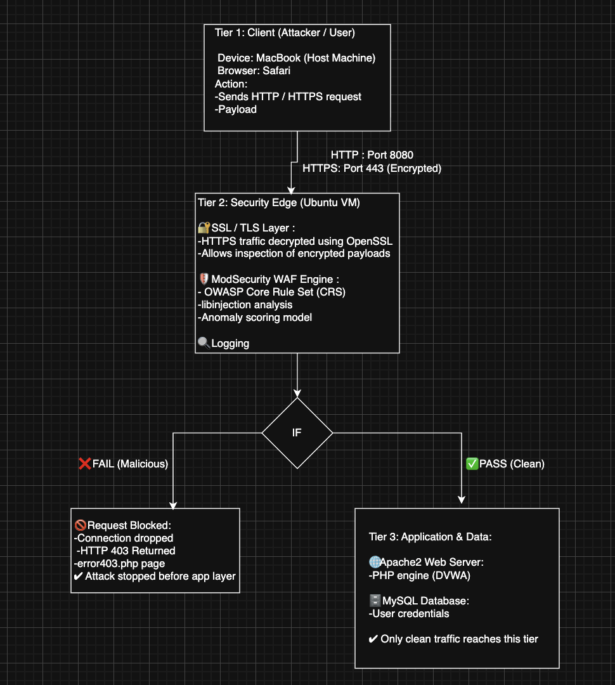
